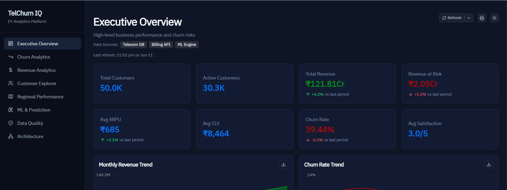
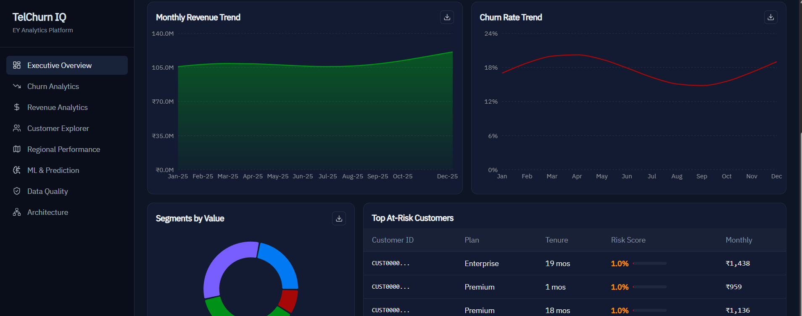
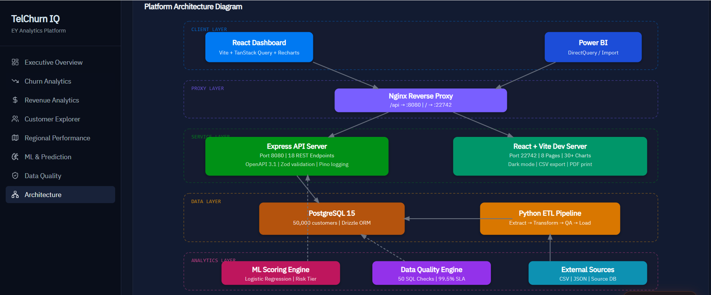
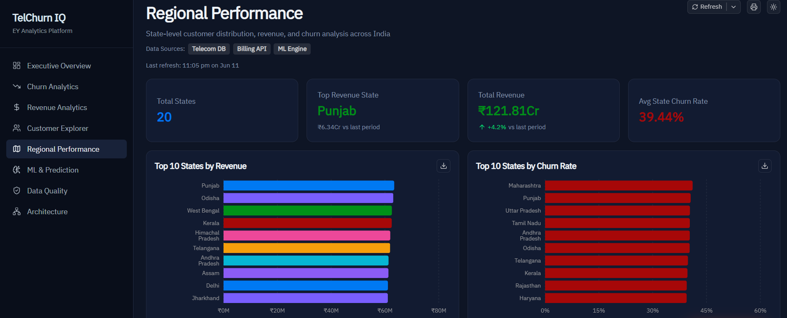

# TelChurn IQ — Telecom Customer Churn & Revenue Intelligence Platform

> **EY-grade, portfolio-ready analytics platform** for a 50,000-customer Indian telecom operator.  
> Built with React + Vite, Express API, PostgreSQL, and ML-based churn scoring.

[](https://typescriptlang.org)
[](https://react.dev)
[](https://expressjs.com)
[](https://postgresql.org)
[](https://docker.com)
[](LICENSE)

---
## Live Preview

### Executive Overview


### Regional Performance


### Architecture


### Revenue & Churn Analytics


### KPI Dashboard

---

## Key Metrics (Live Data)

| Metric | Value |
|--------|-------|
| Total Customers | 50,000 |
| Active Customers | ~30,300 |
| Churn Rate | 39.44% |
| Total Revenue | ₹121.81 Cr |
| Revenue at Risk | ₹2.05 Cr/month |
| ML Model Accuracy | 83.12% |
| ML ROC-AUC | 87.54% |
| States Covered | 20 Indian states |

---

## Architecture

```
┌──────────────────────────────────────────────────────────────┐
│                     Client Browser                           │
│          React 19 + Vite + TanStack Query + Recharts        │
└─────────────────────────┬────────────────────────────────────┘
                          │ HTTPS / Shared Proxy
┌─────────────────────────▼────────────────────────────────────┐
│              Nginx Reverse Proxy (Port 80)                   │
│    /api → Express API Server  |  / → React Dashboard        │
└───────────┬──────────────────────────┬───────────────────────┘
            │                          │
┌───────────▼──────────┐   ┌──────────▼───────────────────────┐
│  Express API Server  │   │  React + Vite Dev Server         │
│  Port 8080           │   │  Port 22742                      │
│  17 REST endpoints   │   │  8 pages, 30+ charts             │
│  OpenAPI 3.1 spec    │   │  IBM Plex Sans, dark mode        │
└───────────┬──────────┘   └──────────────────────────────────┘
            │
┌───────────▼──────────────────────────────────────────────────┐
│              PostgreSQL 15 (DATABASE_URL)                    │
│  Schema: customers (50K rows)                               │
│  Indexes: customer_id, state, risk_tier, churn              │
└───────────┬──────────────────────────────────────────────────┘
            │
┌───────────▼──────────────────────────────────────────────────┐
│              Python ETL Pipeline                             │
│  extract → transform → quality_check → upsert               │
│  Supports: CSV, JSON, PostgreSQL sources                     │
└──────────────────────────────────────────────────────────────┘
```

---

## Tech Stack

### Backend
| Technology | Version | Purpose |
|-----------|---------|---------|
| Node.js | 24 | Runtime |
| Express | 5 | REST API framework |
| PostgreSQL | 15 | Primary database |
| Drizzle ORM | 0.41 | Type-safe SQL |
| Zod | 4 | Schema validation |
| Pino | 9 | Structured logging |
| esbuild | 0.25 | Fast bundling |

### Frontend
| Technology | Version | Purpose |
|-----------|---------|---------|
| React | 19 | UI framework |
| Vite | 7 | Build tool |
| TanStack Query | 5 | Server state management |
| Recharts | 2 | Chart library |
| Wouter | 3 | Client-side routing |
| Tailwind CSS | 4 | Utility-first styling |
| next-themes | 0.4 | Dark/light mode |
| react-csv | 2 | CSV export |
| shadcn/ui | latest | Component library |

### Data & ML
| Technology | Purpose |
|-----------|---------|
| Python 3.12 | ETL pipeline |
| psycopg2 | PostgreSQL Python driver |
| pandas | Data transformation |
| Logistic Regression | Churn scoring model |

### DevOps
| Technology | Purpose |
|-----------|---------|
| Docker | Containerization |
| Docker Compose | Local orchestration |
| Nginx | Reverse proxy |
| pnpm | Package management |

---

## Repository Structure

```
telchurn-iq/
├── artifacts/
│   ├── api-server/          # Express REST API
│   │   ├── src/
│   │   │   ├── app.ts
│   │   │   ├── routes/
│   │   │   │   ├── telecom.ts      # 17 analytics endpoints
│   │   │   │   └── health.ts
│   │   │   └── lib/
│   │   │       ├── seed-telecom.ts # 50K record seeder
│   │   │       └── logger.ts
│   │   └── package.json
│   └── telecom-dashboard/   # React + Vite frontend
│       ├── src/
│       │   ├── pages/       # 8 dashboard pages
│       │   ├── components/  # Reusable UI components
│       │   └── lib/         # Utilities, formatters
│       └── package.json
├── lib/
│   ├── db/                  # Drizzle ORM schema & migrations
│   ├── api-spec/            # OpenAPI 3.1 YAML specification
│   ├── api-client-react/    # Generated React Query hooks
│   └── api-zod/             # Generated Zod validation schemas
├── scripts/
│   └── etl/
│       └── pipeline.py      # Full ETL pipeline with logging
├── docs/
│   ├── sql/
│   │   └── advanced-queries.sql  # 50 production SQL queries
│   ├── powerbi/             # Power BI connection guide + DAX
│   ├── data-dictionary.md   # Complete field documentation
│   └── brd.md               # Business Requirements Document
├── nginx/
│   └── nginx.conf           # Reverse proxy configuration
├── docker-compose.yml       # Full stack orchestration
├── Dockerfile               # API server container
└── README.md
```

---

## Quick Start

### Prerequisites
- Node.js 22+
- pnpm 10+
- PostgreSQL 15+

### 1. Clone and install
```bash
git clone https://github.com/your-org/telchurn-iq.git
cd telchurn-iq
pnpm install
```

### 2. Configure environment
```bash
cp .env.example .env
# Edit .env — set DATABASE_URL to your PostgreSQL connection string
```

### 3. Push database schema
```bash
pnpm --filter @workspace/db run push
```

### 4. Start all services
```bash
# Terminal 1 — API Server
pnpm --filter @workspace/api-server run dev

# Terminal 2 — Dashboard
pnpm --filter @workspace/telecom-dashboard run dev
```

### 5. Open in browser
```
http://localhost:80/
```

The API server seeds 50,000 customer records on first startup (takes ~30 seconds).

---

## Docker Deployment

### Start full stack
```bash
docker compose up -d
```

### Services
| Service | Port | Description |
|---------|------|-------------|
| `nginx` | `80` | Reverse proxy |
| `api` | `8080` | Express API server |
| `dashboard` | `22742` | React dev server |
| `db` | `5432` | PostgreSQL |

### Stop
```bash
docker compose down
```

---

## API Reference

Base URL: `/api`

| Method | Endpoint | Description |
|--------|---------|-------------|
| GET | `/telecom/summary` | Executive KPIs |
| GET | `/telecom/churn-overview` | Churn breakdown |
| GET | `/telecom/revenue-trends` | Monthly revenue |
| GET | `/telecom/customer-segments` | Segment analysis |
| GET | `/telecom/regional-performance` | State-level data |
| GET | `/telecom/churn-drivers` | Feature importance |
| GET | `/telecom/plan-performance` | Plan metrics |
| GET | `/telecom/top-at-risk` | High-risk customers |
| GET | `/telecom/ml-metrics` | Model performance |
| GET | `/telecom/network-analysis` | Network impact |
| GET | `/telecom/arpu-trends` | ARPU by plan/month |
| GET | `/telecom/clv-distribution` | CLV buckets |
| GET | `/telecom/customers` | Paginated list + search |
| GET | `/telecom/customers/:id` | Single customer detail |
| GET | `/telecom/satisfaction-distribution` | CSAT breakdown |
| GET | `/telecom/payment-methods` | Payment analysis |
| GET | `/telecom/contract-analysis` | Contract metrics |
| GET | `/telecom/data-quality` | DQ metrics |

Full OpenAPI spec: `lib/api-spec/openapi.yaml`

---

## ETL Pipeline

```bash
# Install Python dependencies
pip install psycopg2-binary pandas

# Load from CSV
python scripts/etl/pipeline.py --source csv --file data/customers.csv

# Load from JSON
python scripts/etl/pipeline.py --source json --file data/customers.json

# Full refresh from source PostgreSQL
python scripts/etl/pipeline.py \
  --source postgres \
  --query "SELECT * FROM raw_customers" \
  --full-refresh

# Dry run (no DB writes)
python scripts/etl/pipeline.py --source csv --file data.csv --dry-run
```

---

## SQL Query Library

50 production-grade SQL queries in `docs/sql/advanced-queries.sql`:
- **Q01–Q15**: Churn analysis and segmentation
- **Q16–Q25**: Revenue analytics
- **Q26–Q35**: Customer segmentation (RFM, lifecycle, behavioral clusters)
- **Q36–Q45**: ML feature engineering and model evaluation
- **Q46–Q50**: Data quality checks

---

## Power BI Integration

See `docs/powerbi/connection-guide.md` for:
1. PostgreSQL DirectQuery connection setup
2. All 25 DAX measures
3. Report layout specifications
4. Recommended visuals and slicers

---

## Development

### Type checking
```bash
pnpm run typecheck
```

### Regenerate API client
```bash
pnpm --filter @workspace/api-spec run codegen
```

### Database schema changes
```bash
# Edit lib/db/src/schema/customers.ts
pnpm --filter @workspace/db run push
```

---

## Contributing

This project was developed as an EY Analytics practice portfolio piece. For questions or collaboration, open a GitHub issue.

---

## License

MIT — see [LICENSE](LICENSE)

---

*Built with precision for the EY Telecom Analytics Practice.*  
*50,000 customer records | 17 API endpoints | 8 dashboard pages | 50 SQL queries*
